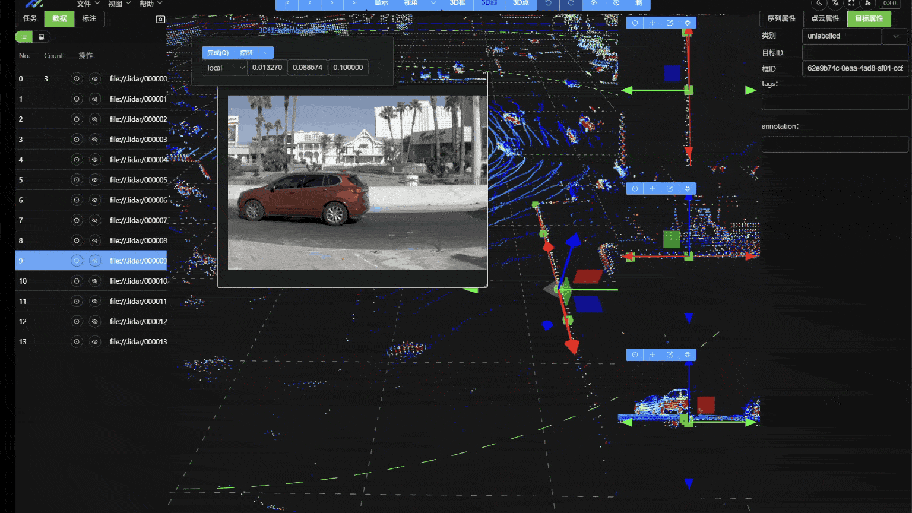
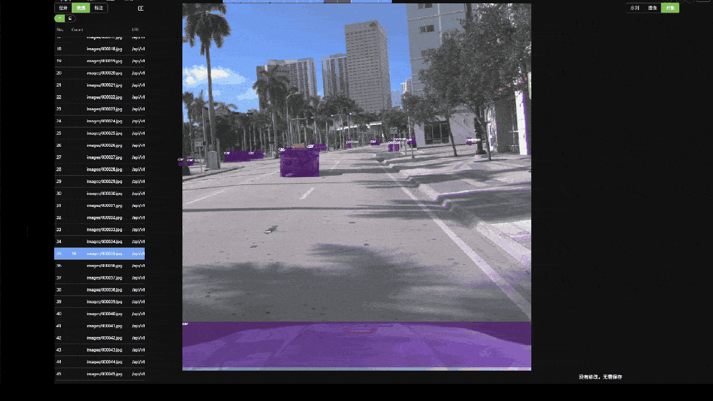
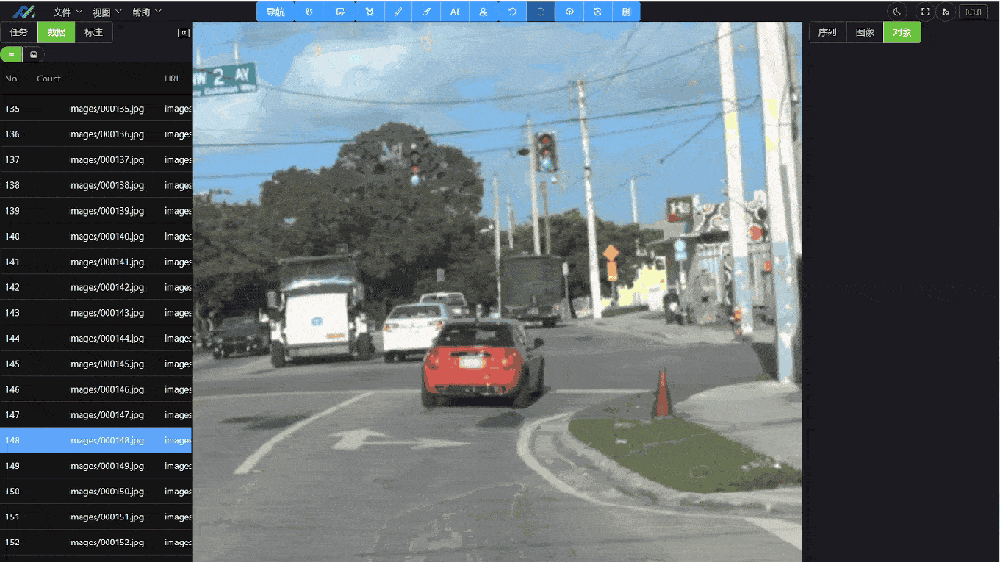

[README_EN](README_EN.md) | [README中文](README.md)

[github](https://github.com/geluzhiwei1/yinghuo-openlabel) | [gitee](https://gitee.com/gerwee/yinghuo) | [官网](https://www.geluzhiwei.com/) 


# Yinghuo-OpenLabel: 专业级开源数据标注平台

`Yinghuo-OpenLabel` 是一个专业的、开源的数据标注平台，专为自动驾驶、机器人和计算机视觉领域设计。它提供了一套完整的工具链，用于处理和标注复杂的传感器数据（如 2D 图像、视频和 3D 点云），并深度集成了 AI 辅助标注功能以显著提升标注效率。

本项目参考 **OpenLABEL** 国际标准，确保了数据的互操作性、规范性和可扩展性。





## ✨ 核心功能

*   **多模态数据标注**:
    *   提供强大的标注工具集，支持对图像、视频和 3D 点云数据进行精细化标注。
    *   支持多种标注类型，如 2D 边界框、语义分割、3D 立方体、关键点等。
*   **AI 辅助与自动化**:
    *   集成深度学习模型 (DNN) 模块，支持使用 ONNX 等格式的模型进行半自动或全自动标注。
*   **数据与项目管理**:
    *   提供灵活的数据包导入与导出功能。
    *   支持标注任务、标签批次和数据集的系统化管理。
*   **标准化与规范**:
    *   深度集成并遵循 `OpenLABEL` 规范，定义了清晰的数据格式和分类体系（Taxonomy）。
*   **系统管理**:
    *   包含完整的用户、角色和团队管理功能，支持多租户和精细化的权限控制。

##  核心特性和发展路线图

已经完成的功能，正在开发的功能，以及未来的功能规划。

## 📦 三版分发(CE / EE / SaaS)

本项目采用 GitLab 式三版分层:`CE ⊂ EE ⊂ SaaS`,单代码库通过目录挂载切换版本。

| 版本 | 用途 | 仓库 | License | 公开 |
|---|---|---|---|---|
| **CE**(社区版) | 个人/小团队自部署 | 本仓库(`yinghuo-openlabel`) | AGPL-3.0 | 是 |
| **EE**(企业版) | 企业自部署,补 SSO/审计/监控 | `yinghuo-openlabel-ee`(独立私有仓库) | 商业 | 否 |
| **SaaS** | 多租户云服务,补计费/配额/自助注册 | `yinghuo-openlabel-saas`(独立私有仓库) | 商业 | 否 |

### 工作原理

- 主仓库(本仓库)即 CE,含 ~95% 代码
- EE/SaaS 各自独立 git 仓库,通过 `scripts/setup-edition.sh` 在开发/构建期挂载为子目录(symlink)
- `services/web-api/src/yinghuo_app/edition.py` 检测目录存在性 + `YH_EDITION` 环境变量,启动期 fail-fast 防止"声明了 EE 但 ee/ 未挂载"等不一致
- 打包时 `scripts/build-{ce,ee,saas}.sh` 探测挂载点,自动产出对应版本产物

### 开发某版本

```bash
# CE(默认):啥也不需要挂
scripts/setup-edition.sh ce

# EE:挂载 yinghuo-openlabel-ee
YH_EDITION_EE_REPO=git@github.com:your-org/yinghuo-openlabel-ee.git \
  scripts/setup-edition.sh ee

# SaaS:同时挂 EE + SaaS(SaaS 跨包依赖 EE)
YH_EDITION_EE_REPO=...   \
YH_EDITION_SAAS_REPO=... \
  scripts/setup-edition.sh saas
```

挂上后,正常的 `YH_EDITION=ee python ...` / `YH_EDITION=ee pnpm build` 即可。

### 商业授权

EE/SaaS 仓库不对外开放。商业授权请联系维护者。本仓库(CE)严格遵守 AGPL-3.0。
### 📚 标注工具
- 视觉2D标注
    * [√] 2D边界框
    * [√] 2D旋转边界框
    * [√] 语义分割-多边形
    * [√] 语义分割-掩码
    * [√] 视频-事件标注
    * [-] 模型辅助-onnxruntime web
        * [-] 模型加载
        * [-] 模型推理
    * [] 模型辅助-后台服务
- 点云3D标注
    * [-] 3D边界框
    * [-] 3D旋转边界框
    * [-] 语义分割-多边形
    * [-] 语义分割-掩码
- 多模态标注
    * [ ] 点云-图像：点云3D标注投影到2D图像
    * [ ] 图像-文本
    * [ ] 视频-文本
- 4D标注

### 🔧 管理功能

- 数据管理
    * [√] 数据包导入导出
    * [ ] 标注数据审核与校验
- 用户管理
    * [√] 用户登录
    * [ ] 用户和团队管理
    * [ ] 权限控制
- 项目管理
    * [√] 标注任务管理

## 🚀 技术栈

项目采用前后端分离的现代架构，确保了开发效率和系统的可扩展性。

#### 前端 (`apps/web-app`)

*   **核心框架**: Vue 3
*   **语言**: TypeScript
*   **构建工具**: Vite
*   **UI 组件库**: Element Plus

#### 后端 (`services/web-api`)

*   **核心框架**: FastAPI
*   **语言**: Python 3.10+
*   **数据库**: PostgreSQL, FerretDB (提供 MongoDB 兼容接口), Redis
*   **ORM**: Tortoise ORM (PostgreSQL), Motor (FerretDB)
*   **数据处理**: NumPy, Pandas, Open3D, OpenCV

## 🛠️ 快速启动 (开发环境)

请按照以下步骤在本地启动开发环境: [开发环境](docs/dev/start.md)

启动视频演示：[开发环境启动视频](https://www.bilibili.com/video/BV1thJdzMEN6/?spm_id_from=333.1365.list.card_archive.click&vd_source=4262e24d5d41e600eb592442d23fc63e)

## 🛠️ 快速启动 (生产环境)

请按照以下步骤在本地启动开发环境: [生产环境](docs/quick-start.md)


## 📂 项目结构简介

```
.
├── apps
│   └── web-app/          # 前端 Vue 3 应用
├── docker/               # Docker 配置文件
├── docs/                 # 项目文档
├── services
│   └── web-api/          # 后端 FastAPI 应用
└── scripts/              # 辅助脚本
```

## 🤝 贡献指南

我们欢迎任何形式的贡献！请参考 `CONTRIBUTING.md` (待补充) 获取更多信息。

# 微信公众号 格律至微

关注公主号，获取更多技术文章和项目更新。


## License

This project is licensed under the AGPL-3.0 License. See the [LICENSE](LICENSE) file for details.
