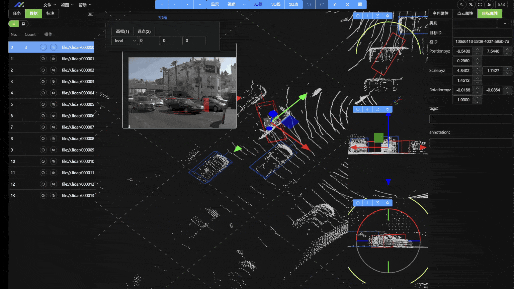

[English](README.md) | [中文](README_ZH.md)

[](https://github.com/geluzhiwei1/yinghuo-openlabel/actions/workflows/build.yml)
[](LICENSE)
[](https://github.com/geluzhiwei1?tab=packages)

[github](https://github.com/geluzhiwei1/yinghuo-openlabel) | [gitee](https://gitee.com/gerwee/yinghuo) | [Website](https://www.geluzhiwei.com/) | [Live Demo](https://www.geluzhiwei.com/guis/yinghuo/home.html)

# Yinghuo-OpenLabel: A Professional Open-Source Data Annotation Platform

`Yinghuo-OpenLabel` is a professional, open-source data annotation platform designed for autonomous driving, robotics, and computer vision. It provides a complete toolchain for processing and annotating complex sensor data (2D images, videos, and 3D point clouds), with deeply integrated AI-assisted annotation to significantly boost labeling efficiency.

The project follows the **OpenLABEL** international standard, ensuring data interoperability, consistency, and extensibility.

## 🌐 Live Demo

Try the latest CE release without installing anything (data is reset periodically):

**https://www.geluzhiwei.com/guis/yinghuo/home.html**

Demo accounts (password `yinghuo` for all):

| Account | Role |
|---|---|
| `prod@geluzhiwei.com` | Tenant admin (primary) |
| `test-tenant-admin@geluzhiwei.com` | Tenant admin |
| `test-annotator@geluzhiwei.com` | Annotator |
| `test-reviewer@geluzhiwei.com` | Reviewer |




## ✨ Core Features

*   **Multi-modal annotation**: Fine-grained labeling of images, videos, and 3D point clouds — 2D boxes, rotated boxes, polygon/mask segmentation, 3D boxes, 3D polylines, and more.
*   **Point cloud–image synchronization**: 3D annotations are projected onto surround-view camera images in real time for cross-modal verification.
*   **AI assistance & automation**: Integrated ONNX Runtime Web for semi/fully-automatic pre-labeling right in the browser.
*   **Data & project management**: Data package import/export, plus systematic management of annotation tasks, label batches, and datasets.
*   **Standardization**: Follows the `OpenLABEL` specification with a clear data format and taxonomy.

## 🧭 Roadmap

Legend: `[√]` done · `[-]` in progress · `[ ]` planned

### 📚 Annotation Tools

- Visual 2D Annotation
    * [√] 2D Bounding Box
    * [√] 2D Rotated Bounding Box
    * [√] Semantic Segmentation - Polygon
    * [√] Semantic Segmentation - Mask
    * [√] Video - Event Annotation
    * [-] Model Assistance - ONNX Runtime Web
        * [-] Model Loading
        * [-] Model Inference
    * [ ] Model Assistance - Backend Service
- Point Cloud 3D Annotation
    * [√] 3D Bounding Box
    * [√] 3D Polyline
    * [√] Point Cloud–Image: project 3D annotations onto 2D images
    * [-] 3D Rotated Bounding Box
    * [ ] Semantic Segmentation - Polygon
    * [ ] Semantic Segmentation - Mask
- Multi-modal Annotation
    * [ ] Image-Text
    * [ ] Video-Text
- 4D Annotation (planned)

### 🔧 Management Features

- Data Management
    * [√] Data Package Import/Export
    * [ ] Annotation Data Review and Validation
- User Management
    * [√] User Login
    * [ ] User and Team Management
    * [ ] Permission Control
- Project Management
    * [√] Annotation Task Management

## 📦 Editions

| Edition | Use case | License | Open source |
|---|---|---|---|
| **CE** (Community, this repo) | Self-hosting for individuals & small teams | AGPL-3.0 | Yes |
| **EE** (Enterprise) | Enterprise self-hosting: SSO, audit, monitoring, backup | Commercial | No |
| **SaaS** | Multi-tenant cloud service: billing, quotas, tenant management | Commercial | No |

EE/SaaS source code is not public. For commercial licensing please contact the [maintainer](https://www.geluzhiwei.com/). This repository (CE) is strictly AGPL-3.0.

## 📚 Documentation

| Doc | Description |
|---|---|
| [Quick Start (CN)](docs/user/quick-start.md) / [Quick Start (EN)](docs/user/quick-start.en.md) | One-command production deployment via Docker Compose |
| [Dev Environment Setup](docs/dev/start-ce.md) | Local frontend/backend development setup (CN) |
| [Architecture](docs/dev/architecture.md) | Service topology, API prefixes, configuration, data model (CN) |
| [Image Release](docs/dev/release.md) | Build & publish Docker images to ghcr.io (CN) |
| [Production Deployment](docker-production/README.md) | Edition compose stacks, ports, volumes (CN) |
| [Changelog](CHANGELOG.md) | Release history |

## 🚀 Quick Start

### Production (Docker Compose)

```bash
git clone https://github.com/geluzhiwei1/yinghuo-openlabel.git
cd yinghuo-openlabel/docker-production
cp env-templates/.env.ce.template .env.ce
docker compose --env-file .env.ce -f docker-compose.ce.yaml up -d
```

Open `http://localhost:6600/guis/yinghuo/home.html` and sign in with `prod@geluzhiwei.com` / `yinghuo`.

See the [Quick Start](docs/user/quick-start.en.md) for details.

### Development

See [Dev Environment Setup](docs/dev/start-ce.md) (Chinese).

Demo video: [Bilibili](https://www.bilibili.com/video/BV1thJdzMEN6/?spm_id_from=333.1365.list.card_archive.click&vd_source=4262e24d5d41e600eb592442d23fc63e)

## 🛠️ Tech Stack

Front-end / back-end separated architecture.

### Frontend (`apps/web-app`)

*   **Framework**: Vue 3 + TypeScript
*   **Build tool**: Vite (multi-page app)
*   **UI library**: Element Plus
*   **State management**: Pinia
*   **3D rendering**: Three.js + Rust WASM (point cloud parsing)
*   **Data loading**: @loaders.gl

### Backend (`services/web-api`)

*   **Framework**: FastAPI (Python 3.12+)
*   **Databases**: PostgreSQL + FerretDB (MongoDB-compatible) + Redis
*   **ORM**: Tortoise ORM (PostgreSQL), Motor (FerretDB)
*   **Data processing**: NumPy, Pandas, OpenCV, Open3D

## 📂 Project Structure

```
.
├── apps
│   └── web-app/          # Vue 3 frontend
├── services
│   └── web-api/          # FastAPI backend
├── docker/               # Docker configs for development
├── docker-production/    # Docker Compose stacks for production
├── scripts/              # Build / release / dev scripts
└── docs/                 # Documentation
```

## 🤝 Contributing

Contributions are welcome! Please see [CONTRIBUTING.md](CONTRIBUTING.md) (Chinese).

# WeChat Official Account: 格律至微

Follow us for technical articles and project updates (Chinese).


## License

This project is licensed under the AGPL-3.0 License. See the [LICENSE](LICENSE) file for details.
